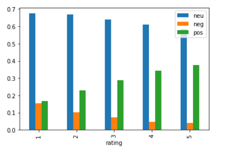
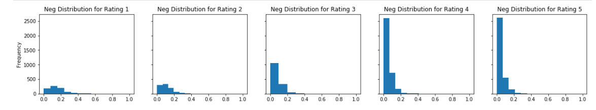
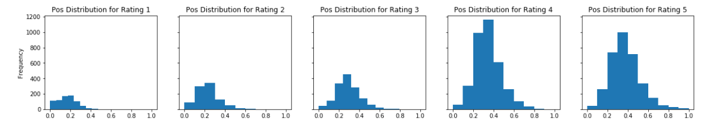
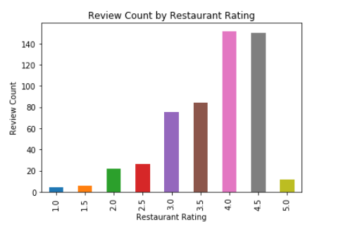
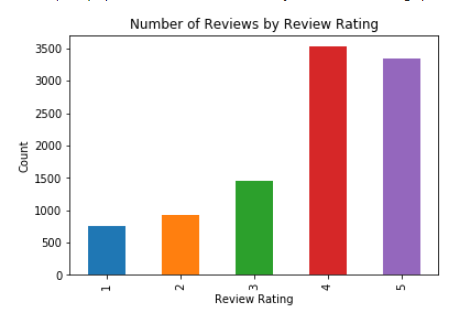
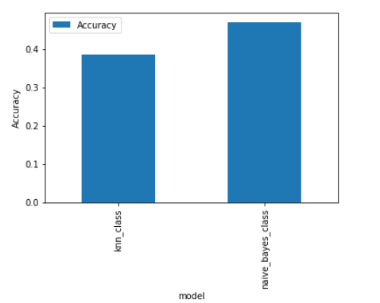
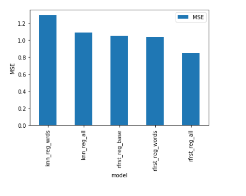
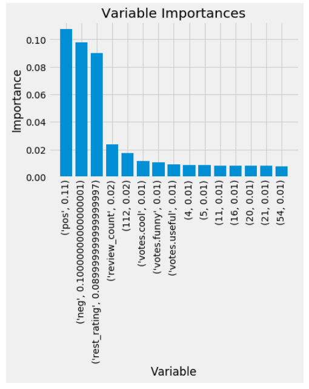
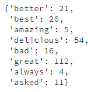

# YelpReviews
A look into Yelp user behavior and their ratings.
Presentation:
https://docs.google.com/presentation/d/1sg9R01Zi_Lv68AFLkTjxdwlEZKPFgHOPgBGbtrX1v8A/edit?usp=sharing

# Data Collection and Cleaning

### Method 1
Since we were only allowed one response entry per API call from Yelp Fusion API, we needed to have some sort of iterator to loop through a set of entries (id, business, etc)

To do this, we scrapped from a webpage, the top 400 cities in the United States (Beautiful Soup). Using each city, we acquired five businesses which included various business information as well as its business ID. Once the reviews have been retrieved, they are merged with the business dataset to obtain more variety of columns

### Method 2 (Chosen)
The result of the API calls were broken reviews and limited information on reviews so we resorted to using a json file found on a Yelp sentiment competition.

Since our API calls only managed to get 10,000 reviews, we felt that it was only fair to use the same number of reviews from the Kaggle JSON file even though it had over 100,000 reviews.

Most of the results were actually the same, except for the fact that full reviews just yielded stronger differences in negative and positive sentiment.

Similar to method 1, we merged reviews with businesses to obtain more information per review (location, business type, etc):

**all_reviews = reviews.merge(bus,on="business_id",how="left")**

### Exploration
First we wanted to break down sentiments by rating, and of course, found that lower ratings had much higher negative sentiment compared to other ratings. What was interesting was simply the differences of mean positive and mean negative sentiments by rating. Whether or not a rating was 1 or 5, they all tended to contain various degrees of negative sentiment, but what may have been a stronger indicator of rating was the positive sentiment within a review.

Next, after examining the data, we found that sentiment results for certain ratings are heavily affected by the frequencies of certain ratings in the dataset. To examine this, we plotted the frequencies of each review rating, and restaurant review rating. It is clear that a rating of 1 was given the least often and 4 the most. This makes sense since a collection of ratings result in a less extreme rating, whereas users are free to choose from 1-5 on their reviews

As a result, we would get very little restaurant ratings of 5 and 1-2. Users tend to give a rating higher than 2 since bad sentiment is often balanced out by good aspects of a service/business. The frequencies of ratings directly affects the predictability of ratings since there are just less 1 and 2 rating than there are 4 and 5 ratings. Simply put, there is less information on lower ratings for predictability. Which may result in higher accuracy in predicting higher ratings, and lower accuracy when predicting lower ratings

# Machine Learning
There are several machine learning models that we used to predict the various ratings of reviews.

## Classifiers

Initially, we felt that since review ratings fell into 1 of 5 categories (1-5), we would predict each rating by using a classifier. First we attempted a classifier using KNN, and acquired an accuracy of .38 which is only a slightly better than just guessing one of the five ratings (.20).

To give some sort of comparison to the KNN-classifier model, we ran a naive-bayes classifier which is a simple probabilistic classifier using Bayes Theorem which describes the liklihood of one event given prior knowledge of prior, similar events. In this case, we used a "naive" Bayes classifier as it assumes strong independence across features making it "naive". This classifier ultimately yielded us a decent result of an accuracy of .47 which is far better than KNN.

## Regressors

### K-Nearest Neighbors Regressor
Since none of the classifier models yielded any significant results, we wanted to see how regressor models matched up. To establish a baseline, we simply chose KNN-regressors with just the words as features. This baseline yielded a result of 1.3 Mean Squared Error. This regressor was far worse than the Naive-Bayes classifier but it gave a better idea of how close our predictions were as we tuned the model and hyperparameters.

The next step was to increase the number of features on the same ML algorithm. This includes using not only the words, but also the sentiment, useful votes, cool votes, funny votes, words, and categories of business types.

This model yielded a MSE of 1.08, which was slightly better than our baseline.

### Random Forest Regressor
Since our best model using KNN was only able to yield a MSE of 1.08, we felt that other algorithms could better achieve rating predictions. We used a random forest regressor which relied on the construction of decision trees on randomized estimators. We felt that this could be an improvement as decision trees by nature, could drastically reduce the error since high rating reviews would much more accuratly be predicted since they had a strong positive sentiment consistently.

In order to obtain the best hyperparameter for the Random Forest Regressor, We ran a RandomizedSearchCV to iterate through combinations of the Random Forest parameters that we specified.

These are just two of the handful of parameters that we have tuned for the model:

Number of trees in random forest:

**n_estimators = [int(x) for x in np.linspace(start = 200, stop = 1000, num = 100)]**

Number of features to consider at every split:

**max_features = ['auto', 'sqrt']**

After running a baseline RF-regressor with just the sentiments, we already got a better MSE of 1.03.

Then, with the addition of several features, as well as the tuning of hyperparameters to those features, we find the best parameters to run our model on:

**{'n_estimators': 967, 'min_samples_split': 5, 'min_samples_leaf': 2, 'max_features': 'sqrt', 'max_depth': 90, 'bootstrap': True}**

We finally obtained a result of .85 MSE from a Random Forest Regressor containing all the columns of the review.

With an MSE of ***.85***, we were able to predict ratings with under 1 rating point error which we consider to be a drastic improvement from the other models. This implied that our model was able to at least get somewhat of a ballpark of a review's rating.

### Importance

To no surprise, sentiment within the review itself presented itself as the most important feature of our best model. As shown in previous visualizations, negative sentiment tended to exist throughout all types of ratings which resulted in it being the second most important after positive sentiment.

The visualization contains vectorized words in the form of their index so to find the words. After looking up, by index, each of the words from the vectorizor model, we see that words of sentiment were indeed, important to the prediction of a rating.

# Conclusion
Sentiment analysis shows the predictability of user review/rating patterns. Although review texts are user-written which includes a degree of randomness, there is still a measurability of the sentiment behind a review. After all, any decent review needs to contain SOME sentiment for it to have any usefulness and meaning with rating.

With better models and more control over features, the more specific the results. For example, we could analyze trends of sentiment based on business types, user types, and locations. Such trends could be generated into useful information that potentially Yelp or Businesses could use for gain a better understanding of users behavior and various aspects of a business.

## Takeaway
Although this is just the tip of the iceberg in terms of what could be taken from sentiment analysis and these machine learning models, it shows that with some knowledge and effort, interesting results could easily be extracted from data.
